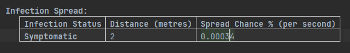
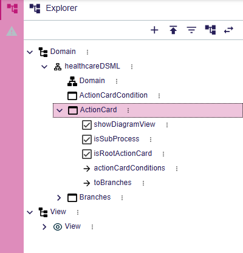
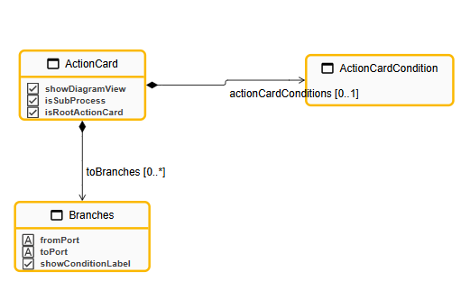
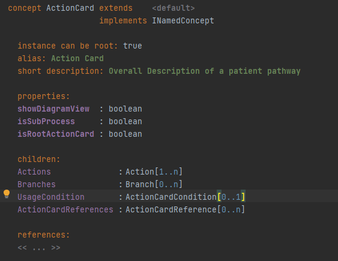
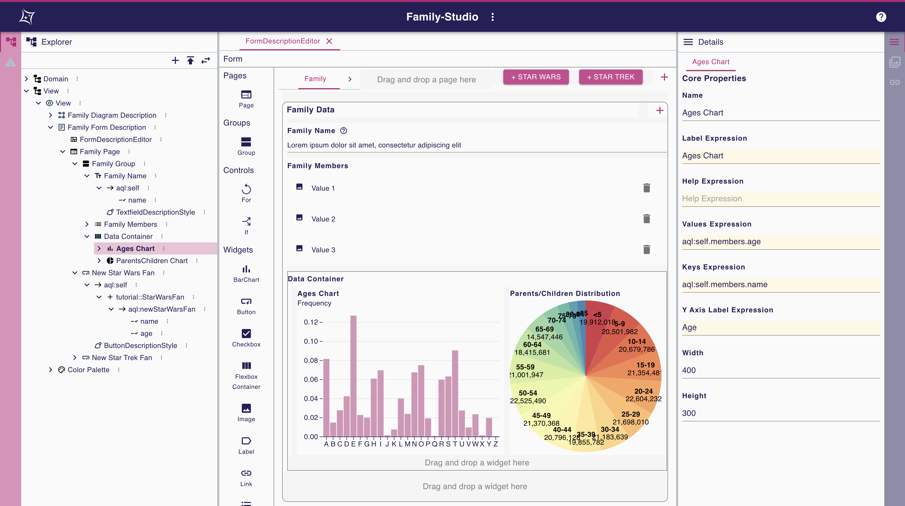

# DSL migrating

# GLSP

## Abstract Syntax

Glsp pipeline -> meta model(abstract syntax) - graphical model - frontend display (concrete syntax)

### 1. Convert MPS models into ecore models with EMF for healthcare dsml and agent langauge - java server

* each concept into an **Eclass**
* * **EClass** ：MPS `Concepts`
  * **EAttribute** ：`property` in MPS - has type: Etype
  * **EReference** ：`Reference/child` in MPS
* Possible **Object Constraint Language** in EMF and validation

### 2. Generate model from ecore

* Replace template with .ecore model and generated model

### 3. For nodejs server

* converting into type script such as
* ```
  ## cocnepts with attributes in MPS
  export interface Task {
      id: string;
      name: string;
      position: { x: number; y: number };
      size?: { width: number; height: number };
  }

  export namespace Task {
      export function is(object: any): object is Task {
          return AnyObject.is(object) && hasStringProp(object, 'id') && hasStringProp(object, 'name') && hasObjectProp(object, 'position');
      }
  }
  ```

## Concrete Syntax

### Server side

* Action handler for user interaction - received from client
* ```
  `public class CreateActionCardCommandHandler extends AbstractOperationHandler {
      @Override
      public void execute(Operation operation) {
        // get name etc
        // new action card instance
        // update model
      }
    }
  ```
* Model creation

  * Model factory
  * Model storage
  * Define how model represent in front end (NOT DEFINED IN CLIENT)
  * ```
    protected createTaskNode(task: Task): GNode {
                const builder = GNode.builder()
                    .id(task.id)
                    .addCssClass('tasklist-node')
                    .add(GLabel.builder().text(task.name).id(`${task.id}_label`).build())
                    .layout('hbox')
                    .addLayoutOption('paddingLeft', 5)
                    .position(task.position);

                if (task.size) {
                    builder.addLayoutOptions({ prefWidth: task.size.width, prefHeight: task.size.height });
                }

                return builder.build();
            }

    ```
  * Bind eventlistener to the new node/edge etc.
  * For Diagram editor

    * First build our own Graphical model - such as - this create a list of named entities. Each entity should be visualized as a node with a label, which indicates its name. Give them our specificed **Type**
    * ```
      public class MyModelFactory implements GModelFactory {

         @Inject
         protected MyModelState modelState;

         @Override
         public void createGModel() {

            List<Entity> entities = modelState.getModel().getEntities();

            List<GModelElement> entityNodes = entities.stream().map(entity -> //
            new GNodeBuilder("node:entity")
               .layout("vbox")
               .add(new GLabelBuilder()
                  .text(entity.getName())
                  .build())
               .build())
               .collect(Collectors.toList());

            GGraph newModel = new GGraphBuilder()
               .id("entity-graph")
               .addAll(entityNodes)
               .build();

            modelState.updateRoot(newModel);
         }
      }
      ```
    * This will transfer to front end, tell what need to render
    * Second, build frontend rendering views. Some views are provided, but not quite usable for our diagram editor
    * The element with the given **type** will rendering within specific views, such as
    * ```
      @injectable()
      export class GLabelView extends ShapeView {
        render(
          label: Readonly<GLabel>,
          context: RenderingContext
        ): VNode | undefined {
          if (!isEdgeLayoutable(label) && !this.isVisible(label, context)) {
            return undefined;
          }
          const vnode = <text class-sprotty-label={true}>{label.text}</text>;
          const subType = getSubType(label);
          if (subType) {
            setAttr(vnode, "class", subType);
          }
          return vnode;
        }
      }
      ```

### Client Side

* Represent
* send user interaction to server

## Coporate with Langium

crossmodel project


## Allow us to do

* Quickly migrate our healthcare dsl into ecore models - if we use java server - else need to write it in typescript
* gui editor for users, but need more time on converting current diagram editor into new graphical elements/views
* how to deal with word editors? how to deal with boolean attributes?


# Langium

## Abstract Syntax

### 1. Convert MPS concepts into Langium grammar rules for healthcare DSL and agent language

* Each concept in MPS becomes a **grammar rule** in Langium.
* ```
  grammar Healthcare
  Model:
    elements+=Element*
  ;

  Element:
    ActionCard | Agent | Behavior
  ;

  ActionCard:
    'actioncard' name=ID '{'
      'isRootActionCard' isRootActionCard=Boolean
    '}'
  ;

  Agent:
    'actors' name=ID '{'
      ('behaviors' '{' behaviors+=BehaviorRef* '}')?
    '}'
  ;

  Behavior:
    'behavior' name=ID '{'
      ('actions' '{' actions+=ActionCardRef* '}')?
    '}'
  ;

  BehaviorRef:
    behavior=[Behavior]
  ;

  ActionCardRef:
    actionCard=[ActionCard]
  ;
  ```

* **Grammar Rule** : MPS `Concepts`
* **Properties** : MPS `Properties`, defined as attributes in the grammar rule.
* **References** : MPS `References` or `Children`, defined as references to other rules.
* Multiple langium grammar files available -> can reference to each part in healthcare DSML

### 2. Validator for grammar file

* MPS `constraints` -> validator

### 3. Tweak CLI and Auto Generate AST

## Concrete Syntax

* Directly in grammar file
* Converting current diagram editor into pure text
* 
* ```
  grammar InfectionSpread

  entry InfectionSpreadModel:
      'Infection Spread:' entries+=InfectionEntry*;

  InfectionEntry:
      'Infection Status' ':' status=ID
      'Distance (metres)' ':' distance=INT
      'Spread Chance % (per second)' ':' chance=DECIMAL;

  terminal DECIMAL returns ecore::EDouble: ('0'..'9')+ '.' ('0'..'9')*;

  sample:
  Infection Spread:
  Infection Status: Symptomatic
  Distance (metres): 2
  Spread Chance % (per second): 0.00034
  ```

## Allow us to do

* Langium's grammar to define both abstract and concrete syntax in **one place**.
* Automatically generate the AST and all necessary files.
* implement code generator by traverse the AST to translate models into new model - new type of agent language (healthcare -> repast directly) - with typescript - potential possible
* Potentially integrate with glsp
* or possible we add some frontend graphical editor for langium? langium can working without backend for praser


# Sirius Web

`docker run -p 5433:5432 --rm --name sirius-web-postgres -e POSTGRES_USER=dbuser -e POSTGRES_PASSWORD=dbpwd -e POSTGRES_DB=sirius-web-db -d postgres:12`

`java -jar sirius-web.jar --spring.datasource.url=jdbc:postgresql://localhost:5433/sirius-web-db --spring.datasource.username=dbuser --spring.datasource.password=dbpwd`

## Abstract Syntax

With Domain model editor：







* Create entities corresponding to the MPS model in the Domain Model Editor of Sirius Web:

  * **Entity**: Convert each concept of MPS to an entity in Sirius.
  * **Property**: Map the properties in MPS to the attributes of Sirius entities.
  * **Reference**: Map the sub-elements and references in MPS to the relationships in Sirius.

* Create graphical representations for each domain model entity in the Representation Editor, such as:

  * Define a node for Action Card and display its properties.
  * Define conditional logic nodes for ActionCardCondition and connect them to the ActionCard node.
* [Build constraints in local java server](https://github.com/ObeoNetwork/Sirius-Web-Tutorial/blob/main/sirius-web-tutorial-eclipsecon2023.adoc#java-services-10-min)

## Concrete Syntax

Build representations/views for instances

[Forms available](https://github.com/ObeoNetwork/Sirius-Web-Tutorial/blob/main/sirius-web-tutorial-eclipsecon2023.adoc#sirius-web-forms-demonstration-performed-by-the-obeo-team-5-min)



More gui available via self development


# Gentleman

not working

# Dandelion

not working
